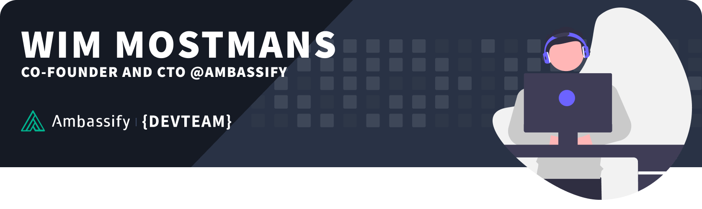

## Hi there 👋! <!-- Star Wars Reference -->

I'm Wim Mostmans, I'm co-founder and CTO [@Ambassify](https://www.github.com). As an autodidact web developer I have over 15 years of experience in development. I've worked as a freelance developer for the last 10+ years developing applications and digital solutions.

Through my study as electronic engineer and specialisation in networks I'm also comfortable setting up my own servers and know my way around Linux systems.

### 💡 Main interests:
- Web technologies
- ⚡ Eletronics
- Productivity and automation
- Cyber security
- Spread sheets
- 3D Printing
- DIY projects (read more about this on [my blog](https://www.sitebase.be/?utm_source=github&utm_medium=social&utm_campaign=profile&utm_content=sitebase))
- 🌱 Gardening
- Mountainbike

### 🧠 Knows about:

### ⚙️ Mostly uses:

### 🎵 My coding playlist:

### 📈 Stats:

### 💪 We are hiring at Ambassify:
Want to join our talented team of developers, working with a modern tech stack creating a product used by large international enterprises? Check out our [Ambassify Job Board](https://ambssfy.notion.site/Job-Board-6ec53c03fcd94e318e68d98c08080d38) or contact me for more info.

